White Rabbit CrackMe
====
Thanks to [@hasherezade](https://twitter.com/hasherezade) and [Grant Willcox](https://twitter.com/tekwiz123) for the crackme

Tools
--
- [IDA Pro][IDA]: Indispensible
- [CFF Explorer Suite][CFF]: Very good PE explorer
- Python: for general messing around

Stage 1: White Rabbit
----

The crackme is ~7MB windows PE32 executable called `white_rabbit.exe`. A quick peek
 in [CFF Explorer][CFF] shows us that the bulk of the exe is in the resources
 (section `.rsrc`):


There are two `RCDATA` resources the first of which (id 101) is the biggest
 and looks suspiciously like a very low entropy file that's been encrypted
 with a [Vignere](https://en.wikipedia.org/wiki/Vigen%C3%A8re_cipher) cipher
 (the giveaway is the repeating patterns):


Running it produces an ASCII art rabbit, a green coloured introduction and a prompt for the first
(of many?) passwords:
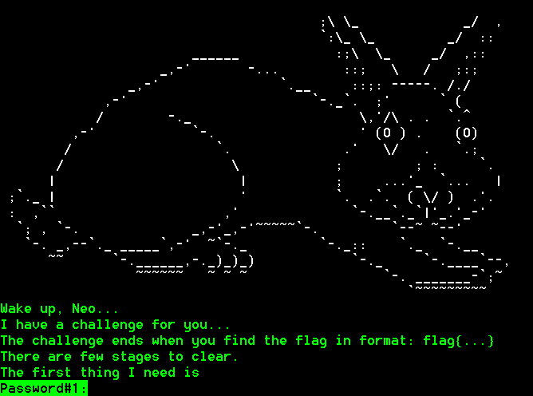

With these hints in mind, let's fire up IDA to have a peek at the code driving all this. After
initial autoanalysis, IDA takes us straigt to `main()`, which seems to have a very
straight-forward structure:
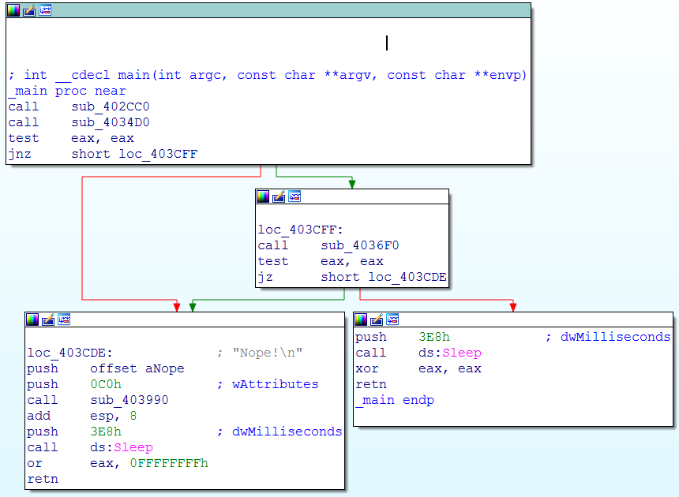

- `sub_402CC0` seems to do the initial setup
- `sub_4034D0` is probably Level1 (returning false triggers a `Nope` and exit)
- `sub_4036F0` is probably Level2 (similar reasoning)

Scanning through the three subs seems to verify our guesses as the first one references the rabbit
ASCII art and the intro text, the second one references the string `Password#1:` and the third one
has a reference to the string `Password#2:` (we could have gotten to the same conclusion by ignoring
programme flow and looking at references to the password prompt strings).
Let's focus on the second sub (which I've renamed `do_level1`). After a bit of boilerplate, it 
calls `sub_403D90(&dword, 0x65)`, where IDA is helpfully pointing out that its second argument
 has something to do with resources:


Indeed, `sub_403D90` loads the resource identified by the second argument, copies into some freshly
allocated memory (courtesy of `VirtualAlloc()`) and returns a pointer to this copy in `eax` while
filling in the size of the loaded resource into the `DWORD` pointed to by the first argument.
Hence we should expect `esi` to point to the loaded copy of resource 101 (the big, low entropy
Vignere'd blob) and `[ebp+nNumberOfBytesToWrite]` to containg its size. The next part looks
slightly more convoluted:


Just looking at the call structure, you'd guess the the first call (`sub_403990`) prints the
password prompt, the second call (`sub_401000`) reads the password and the third one calculates
some checksum or hash that needs to be equal to `0x57585384`. The dataflow in the arguments
to the functions gives the game away as the first function is only given pointers to read-only
data, hence it probably only prints something, the second function gets given a pointer to the
stack argument `[ebp+var_438]` as well as a pointer to a static (which turns out to be `std::cin`)
and the third function gets either the data or a pointer to the same stack argument.

As an aside, the whole run-around with the compare to `0x10` and `cmovnb` arises from an optimization
in the `std::string` implementation where if a string is less than 16 chars long, then it is stored
directly in the `std::string` structure otherwise a memory block is allocated and the first dword
of the structure is set to point to this block. Offset `0x10` (`[ebp+var_428]`) holds the string
`size()` and offset `0x14` (`[ebp+var_424]`) holds the string `capacity()`.

Without further ado, we can rename these three functions to `print_coloured_string`, `read_input_line`
 and `calculate_checksum` respectively.

Looking into `calculate_checksum` doesn't get us much further: It calculates a 32-bit
 [CRC](https://en.wikipedia.org/wiki/Cyclic_redundancy_check)-like checksum using the primitive
polynomial `0x182F63B78`. There are many ways to invert this, but as it only has 32-bits, it
will not give us the complete password we need.

The next segment is a bit more interesting:


Effectively it's just:
 `sub_403C90(resource_101_address, resource_101_size, password1)`. Exactly the signature
we would expect from a decryptor. Looking at the sub itself, it seems to implement a standard
 Vignere-xor cipher: It first calculates the length of the password (`arg_8`) which it stores into
`ecx` and then uses `div ecx` to divide the current offset in the data buffer by the length of
the password and get the remainder into `edx` which it uses as an index into the password:
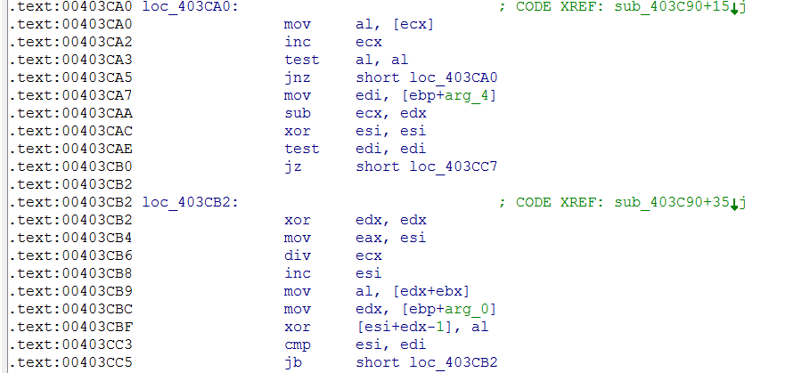

The next part of `do_level1()` is fairly dull: Create a random file name in the temp directory
using the template `wallp{hex number}.tmp` and the save the decrypted resource to it (courtesy of
`sub_403090` which I'm renaming to `save_data_to_file`). Then it calls `sub_403D20` with the
newly created filename as argument:
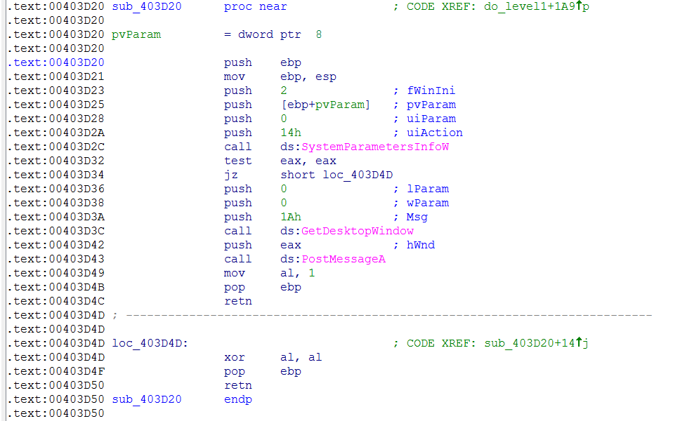

Looking up [`SystemParametersInfo`](https://msdn.microsoft.com/en-us/library/windows/desktop/ms724947(v=vs.85).aspx)
 in MSDN reveals that `0x14` corresponds to `SPI_SETDESKWALLPAPER`
which changes the desktop wallpaper to the supplied file.

Hence we can conclude that resource 101 is a Vignere encrypted low-entropy image file format, hence
most likely a windows BMP file. We can use the information we've gleaned to break the Vignere
cipher. The length of the password is easy to see by looking at the hexdump in CFF explorer: the
 repeating pattern is 17 bytes long. Looking up the specification of BMP files reveals that the
header starts with 'BM' followed by the length of the bitmap in little endian format. Let's use
CFF explorer to save the resource to `res_101.bin` and then load it up in python to play around
 with it (I'm using the `XOR` cipher implementation from the PyCrypto package because I'm lazy
 and I already have this installed, but it's fairly easy to find other implementations
 on the net or write your own version):


With the known plaintext of the BMP header we've recovered the first six characters of the
password: `follow`. The section of the file with the repeating pattern must have contained the
same (constanst) value in the plaintext. We can find this value by xor-ing a segment of that
section with the part of the password we've recovered. Notice that we need to align our partial
decryption with a multiple of 17 (the length of the password):


The long constant sections in the plaintext file are filled with `0x01`, hence it's now trivial
to recover the whole password by xoring one of the repeating segments with the known plaintext of
repeated `0x01`:


And now we have the first password and the decrypted wallpaper:


The `do_level2()` function has a very similar structure to `do_level1()` except that it loads
resource 102, it uses a more complicated decryption function (`sub_403E10`), it saves the result
to an executable in the temp directory with filename template `good_rabbit{hex number}.exe` and
executes it after successful decryption.

The decryption sub seems to be using the Microsoft CryptoAPI with some pretty scary cipher choices
(`0x800C` is `CALG_SHA256` and `0x660E` is `CALG_AES_128`):
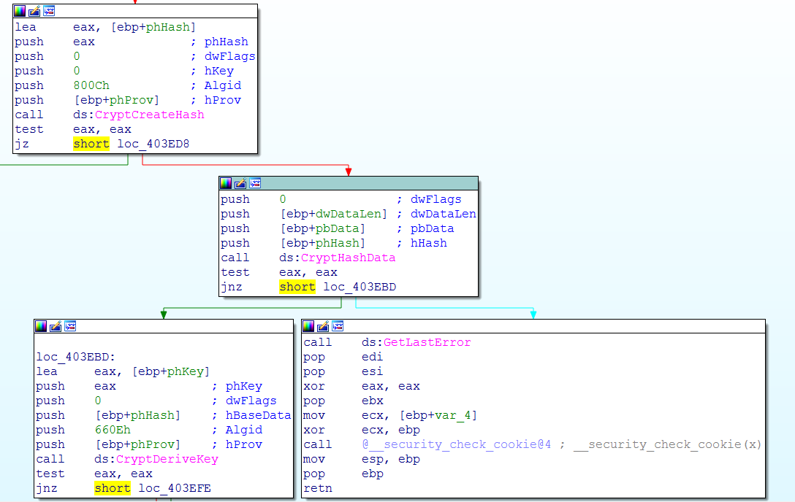

It doesn't look like we'll be recovering the password of this one the same way we did for the 
Vignere cipher, therefore the bitmap that first level dropped must contain some kind of hint.
 There are a number of forensic / steganalysis apps and websites out there. Personally, I first
hit [Forensically](https://29a.ch/photo-forensics/#forensic-magnifier). The Luminance Gradient
 analysis (with histogram equalization) quickly reveals a hidden message:
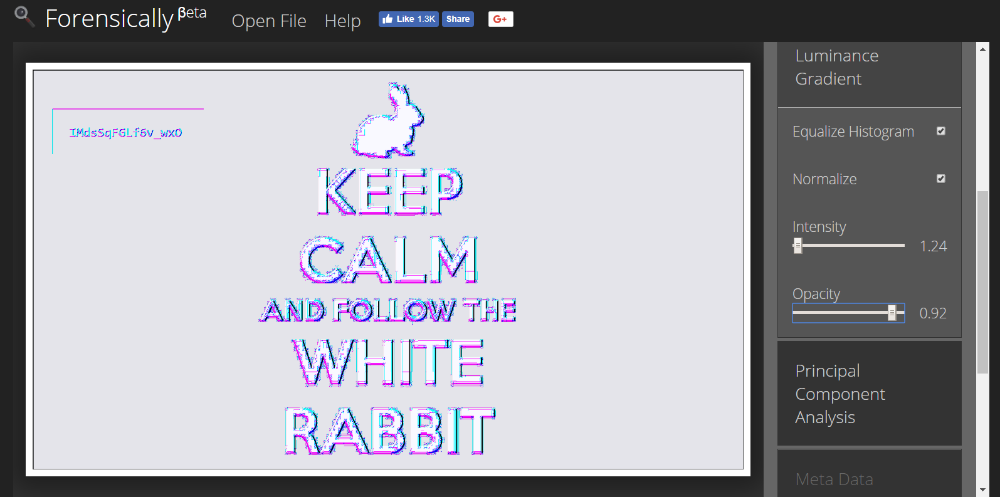

The password for level2 is `IMdsSqFGLf6v_wxO`. We can replicate the decryption function in the
code, however it's just easier to type in the two passwords we've discovered and let `white_rabbit.exe`
drop its `good_rabbit.exe` payload in our temp directory (please tell me you've been running all this
in a VM).

Stage 2: Good Rabbit
----

 The stage 2 payload `good_rabbit.exe` is a ~150KB PE32 executable. It doesn't have any resources
and appears entirely ordinary (except for one detail, which we'll come to later). Running it doesn't
seem to do much - it just hangs there and has to be killed. Time to fire up IDA.

  The `main` function seems straightforward:
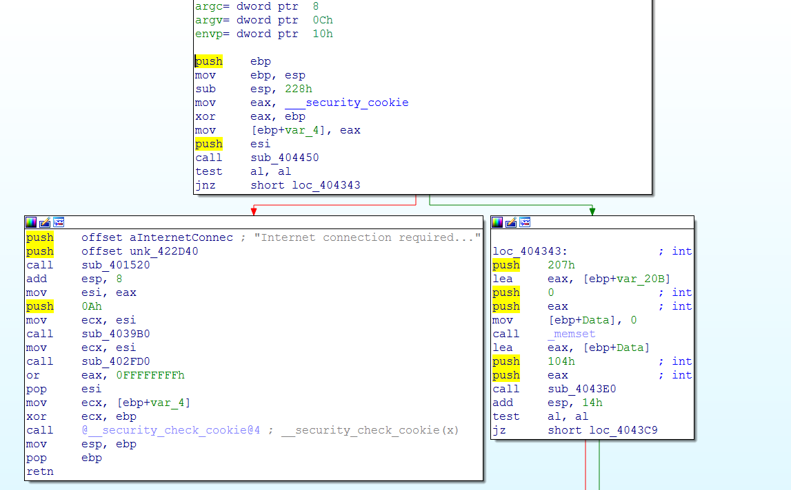
- Check for the presence of internet connection (`sub_404450` calls `InternetGetConnectedState`)
- Inititalize some buffers
- Get the system browser (`sub_4043E0` reads `HKCR\HTTP\shell\open\command`)

The next part is a bit stranger:

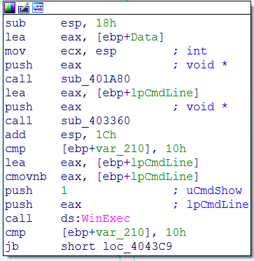

`sub_401A80` looks like a string constructor that's called to construct a string on freshly
 allocated space on the stack (the `sub esp, 18h`). This is the variable `[ebp+lpCmdLine]`
which is initialized to contain the browser name and gets further filled in by `sub_403360`
before being handed off to `WinExec`.

`sub_403360` looks quite complicated: Lots of stack variables, several objects with vtables
being constructed, references to the `iostream` libraries. Two strings stand out:


Looks like it sets up the URL: [https://www.youtube.com/watch?v=dQw4w9WgXcQ](https://www.youtube.com/watch?v=dQw4w9WgXcQ)


Clearly we've missed something. There are a couple of ways to make progress from this point:


1. Persevere with analysing this function and notice that the string that is appended to the youtube URL may also come from `[ebp+var_58]` which is initialised by call call to `sub_403110`:

In turn, this function seems to use some synchronization mechanism that relies on a global mutex
handle stored in `hMutex` which is also referenced by a function called `TlsCallback_0`
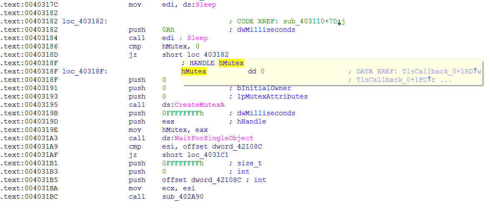

2. Alternatively, a quick look at the strings reveals multiple error messages related to network operations that roll up to `TlsCallback_0`.
3. Looking at the imports turns up references to `socket`, `connect`, etc which all roll up to `TlsCallback_0`
4. Notice the presence of a `TlsDirectory` entry in CFF Explorer

The `.tls` section in PE files provides native support for Thread-Local Storage (i.e. variables
that have separate instances for each running thread). The PE format implementation is described
in [this](https://msdn.microsoft.com/en-us/library/windows/desktop/ms680547(v=vs.85).aspx#the_.tls_section) 
MSDN article. The key point here is that the `TlsDirectory` contains a set of entries that define
callbacks which the OS triggers whenever a process is started or a thread is created or destroyed.
The convention is similar to the one for `DllMain`. Nynaeve has a more in-depth [article](http://www.nynaeve.net/?p=180)
on TLS. Needless to say that IDA already [parses](http://www.hexblog.com/?p=9) that section and
names the callback entries appropriately. 

Which brings us to `TlsCallback_0`:
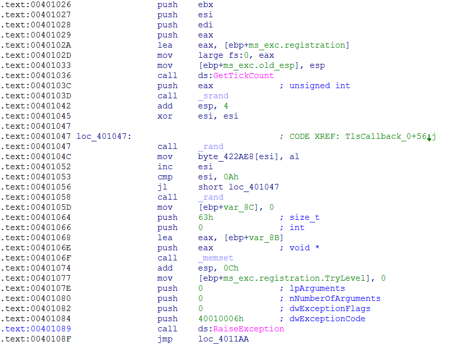

It seems to fill in a small buffer with random numbers and immediately raise an exception! Looking
at the boilerplate at the top of the function, `TlsCallback_0` sets a custom exception handler
which is actually implemented inside the body of the function:
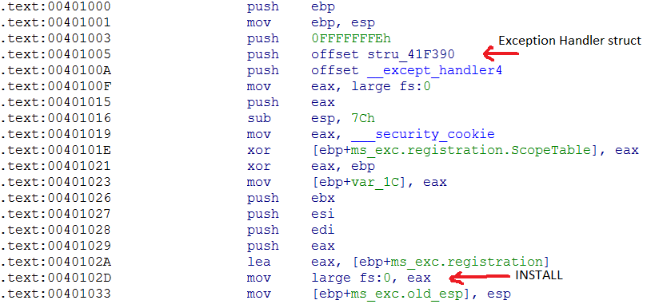


The exception filter picks up all exceptions and the handler just calls `sub_403330` to fill the
same buffer as earlier with random characters and then continues execution as normal. As an aside,
`dword_42109C` is the length of the string that will be exchanged with `main` and that
comparison is there to ensure that this part of the code does not overwrite the stirng twice.

Anyway, it seems that both `sub_403330` and the array at `byte_422AE8` are decoys, so I'll
rename them to `decoy_randomize_array` and `decoy_random_array` respectively.

The rest of `TlsCallback_0` is fairly simple-looking: It calls `sub_404480` and uses a single
character result to decode some bytes into an internal buffer. The calls read as follows:
```C
sub_404480(&local_buf, 1337);
sub_404480(&local_buf, 1338);
sub_404480(&local_buf, 1339);
```

`sub_404480` creates a socket and then decrypts an internet address using the code below:
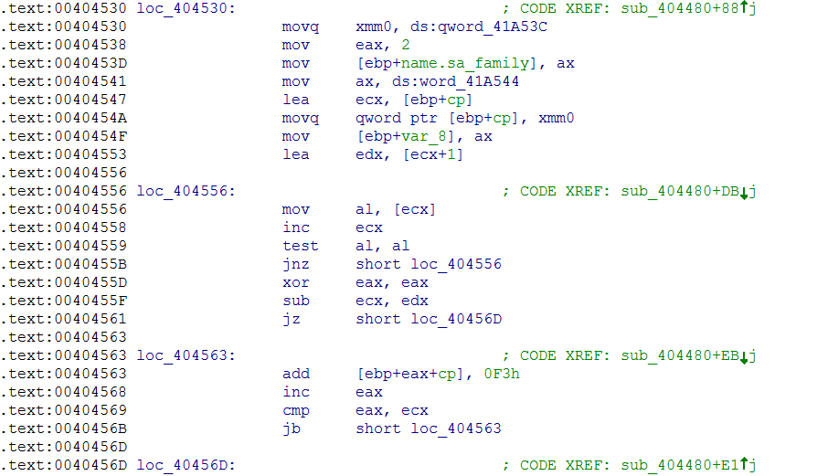
A quick line of IDAPython can sort this one out:
```python
''.join([ chr((ord(x) + 0xf3)&0xff) for x in idaapi.get_many_bytes(0x41a53c,9)])
```
To reveal that the address in question is `127.0.0.1`.
The function then binds to this interface and
the port number given by the second argument to the function (IDA names this `hostshort` because
it's passed to `htons` before being given to `bind`). It then calls `listen` and `accept` to
accept incoming connections and then:
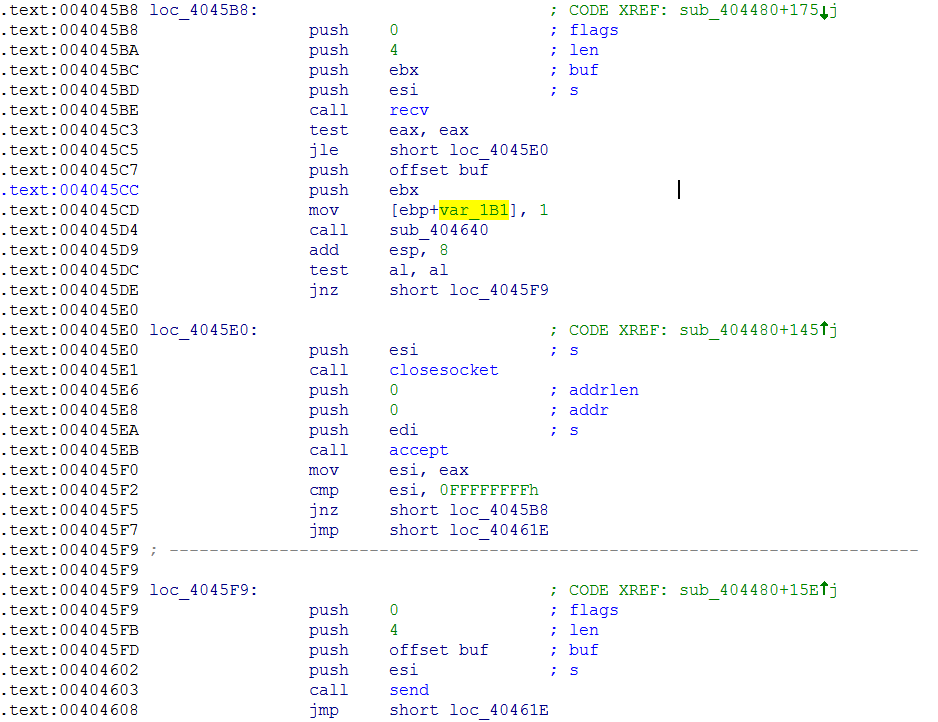

It receives up to four characters into a stack-based buffer which it then passes to `sub_404640`, 
giving it the address of a global buffer (helpfully named `buf` by IDA) as a second argument.
If this call returns success, it sends four characters from the global buffer on the connection as
a response.

The heart of this part of the challenge is the function `sub_404640`, which starts off with:
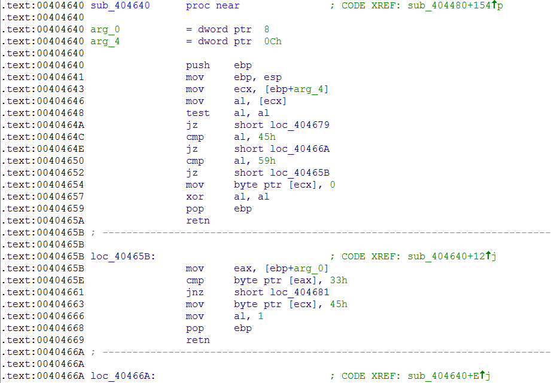

The second argument (`arg_4`) contains a pointer to the global buffer `buf` which this sub keeps
in `ecx`. Looking at the structure of the code, it seems to behanve like a state machine using
the first character of `buf` as the current state and the first character of the incoming message
(pointer to by `arg_0`) as the input. The first segment of the function only accepts states `'\0'`,
`'E'` and `'Y'` as valid states, hence we can make the function easier to read by renaming the
targets of the corresponding branches:
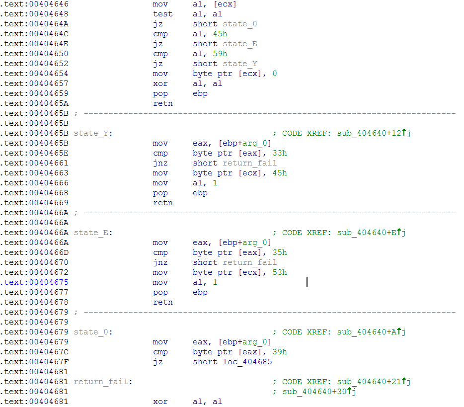

And hence we have the transition diagram:
```
'\0' -- ['9'] -> 'Y'
'Y'  -- ['3'] -> 'E'
'E'  -- ['5'] -> 'S'
```

To recap, `good_rabbit.exe` expects to receive the three characters `'935'` one at a time,
delivered separately to the ports 1337, 1338, 1339. It uses the received characters to decode
a youtube reference which it then pops up. We can reverse engineer the part of `TlsCallback_0`
that decodes the youtube reference, however it's a lot easier to write a Python script that
just delivers the characters to the right ports.

Just fire up `good_rabbit.exe` and then hit [this script](./run_rabbit.py):
```python
from socket import create_connection

for c, p in zip('935', range(1337, 1340)):
    conn = create_connection(('127.0.0.1', p))
    conn.send(c)
    print conn.recv(1)
    conn.close

```
to get:


[IDA]:https://www.hex-rays.com/products/ida/support/download.shtml
[CFF]:http://www.ntcore.com/exsuite.php


